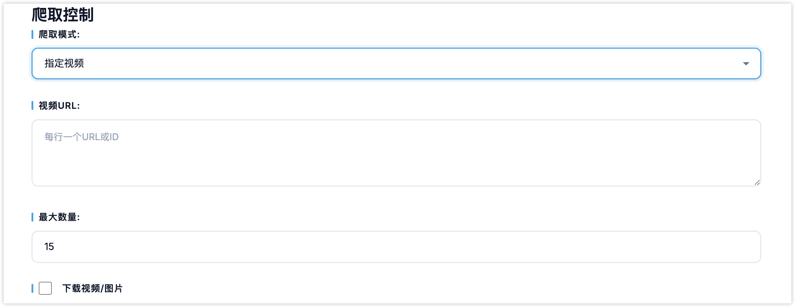

# douyin视频库

一个带有 Web 界面的抖音视频库，支持通过浏览器控制爬虫和查看数据。

## 🎯 功能特性

### 后端 (FastAPI)
- ✅ RESTful API 接口
- ✅ 爬虫启动/停止控制
- ✅ 实时状态监控
- ✅ 数据查询接口
- ✅ CORS 跨域支持

### 前端 (HTML/CSS/JS)
- ✅ 简约现代的界面设计
- ✅ 三种爬取模式切换
- ✅ 实时数据展示
- ✅ 响应式布局

## 📦 安装

### 1. 安装依赖

```bash
pip install -r requirements.txt
playwright install
```

### 2. 配置

后端配置文件在 `backend/config/` 目录：
- `settings.py` - 主配置
- `douyin_config.py` - 抖音配置

## 🚀 启动

### 方式1：使用 Python 直接启动

```bash
python api.py
```

### 方式2：使用 Uvicorn 启动

```bash
uvicorn api:app --reload --host 0.0.0.0 --port 8000
```

启动成功后，访问: **http://localhost:8000**

## 📖 使用说明

### 1. 关键词搜索模式
- 选择"关键词搜索"
- 输入关键词（多个用逗号分隔）
- 设置最大爬取数量
- 点击"开始爬取"

### 2. 指定视频模式
- 选择"指定视频"
- 输入视频URL或ID（每行一个）
- 点击"开始爬取"

### 3. 创作者主页模式
- 选择"创作者主页"
- 输入创作者URL或sec_user_id（每行一个）
- 点击"开始爬取"

### 4. 查看数据
- 切换"视频"和"创作者"标签查看数据
- 点击"查看"链接在新窗口打开视频

## 🔌 API 接口

### 爬虫控制

```
POST /api/start       # 启动爬虫
POST /api/stop        # 停止爬虫
GET  /api/status      # 获取状态
```

### 数据查询

```
GET  /api/videos             # 获取视频列表
GET  /api/videos/count       # 获取视频总数
GET  /api/creators           # 获取创作者列表
DELETE /api/videos/clear     # 清空数据
```

## 📁 项目结构

```
douyin-crawler/
├── api.py                    # FastAPI 后端入口
├── requirements.txt          # Python 依赖
├── README.md                # 项目文档
├── backend/                 # 后端代码
│   ├── config/             # 配置文件
│   ├── crawler/            # 爬虫核心
│   ├── database/           # 数据库
│   ├── utils/              # 工具函数
│   └── libs/               # JS 文件
└── frontend/               # 前端代码
    ├── index.html          # 主页面
    ├── style.css           # 样式文件
    └── app.js              # 交互逻辑
```

## ⚠️ 注意事项

1. **首次运行需要登录**
   - 爬虫会自动打开浏览器
   - 使用抖音APP扫码登录
   - 登录态会自动保存

2. **爬取频率控制**
   - 默认间隔2秒
   - 避免频繁请求

3. **后台运行**
   - 爬虫在后台异步运行
   - 可通过状态接口查看进度

## 🛠️ 技术栈

- **后端**: FastAPI + Playwright + SQLite
- **前端**: HTML + CSS + JavaScript
- **爬虫**: Playwright 浏览器自动化

## 📄 免责声明

本项目仅供学习研究使用，请勿用于商业目的或大规模爬取。
