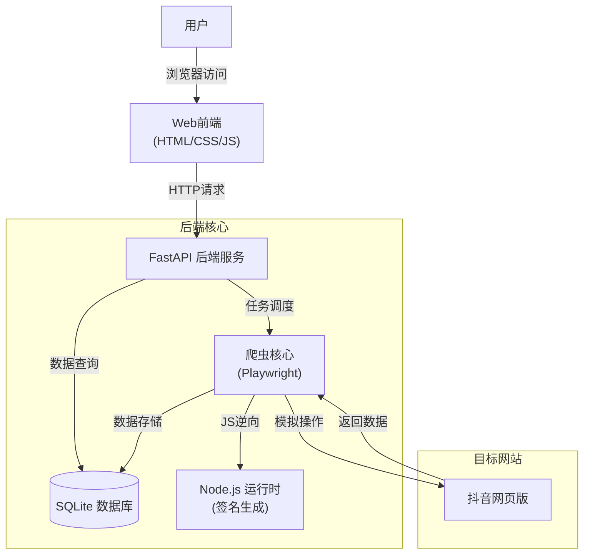
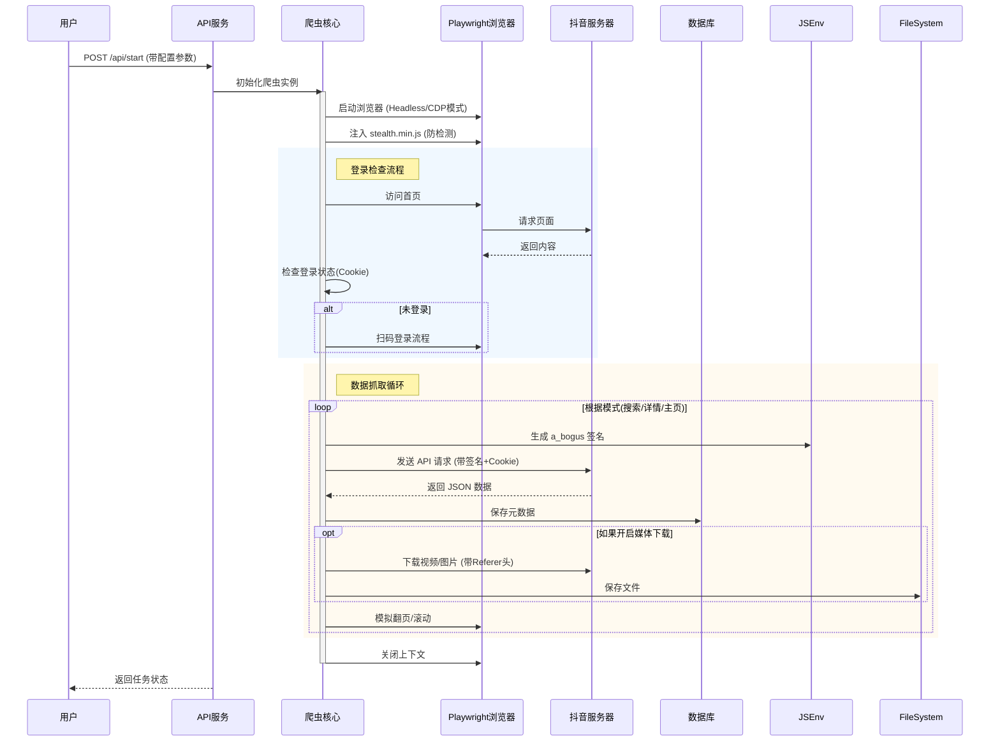

# 深入解析：基于 Playwright 与 FastAPI 的抖音爬虫架构原理

本文将深入探讨本项目的技术架构与实现原理。这是一个集成了现代前端界面、异步 API 服务和高性能爬虫核心的完整解决方案。

## 1. 系统整体架构

本项目采用标准的前后端分离架构，通过 RESTful API 进行通信，底层利用 SQLite 进行数据持久化。



### 关键组件说明

*   **Frontend**: 纯原生 HTML/CSS/JS 实现，无需构建工具，轻量高效。负责参数配置、任务触发和数据展示。
*   **FastAPI**: 高性能异步 Python Web 框架，处理前端请求，管理爬虫生命周期。
*   **Crawler Core**: 基于 Playwright 的异步爬虫，负责浏览器模拟、请求拦截和数据提取。
*   **SQLite**: 轻量级嵌入式数据库，存储视频元数据和创作者信息。

## 2. 核心工作流程

爬虫的执行流程是一个典型的生产者-消费者模型，或者说是基于任务的流水线。



## 3. 关键技术实现原理

### 3.1 浏览器模拟与反爬对抗 (Playwright)

我们选择 Playwright 而不是 Selenium，主要基于以下优势：
1.  **原生异步支持**: 完美契合 FastAPI 的 `async/await` 生态。
2.  **更强的抗检测能力**: 支持 `stealth.min.js` 注入，修改 `navigator` 属性，隐藏自动化特征。
3.  **CDP (Chrome DevTools Protocol) 支持**: 允许更底层的浏览器控制，如网络请求拦截、Console 日志监听。

代码片段 (`core.py`):
```python
# 注入 stealth 脚本，防止被识别为爬虫
await self.browser_context.add_init_script(path="libs/stealth.min.js")
```

### 3.2 JS 逆向与签名生成 (a_bogus)

抖音 API 请求包含核心加密参数 `a_bogus`，这是为了防止接口被滥用。我们采用了"补环境"的方案：
1.  **提取核心 JS**: 从网页中提取出生成签名的混淆 JS 代码。
2.  **模拟执行环境**: 由于 Python 无法直接运行浏览器 JS，我们使用 `execjs` 调用 Node.js 或 JScript 引擎来执行这段代码。
3.  **动态生成**: 每次请求前，将 url、user-agent 等参数传入 JS 函数，实时生成签名。

代码片段 (`helpers.py`):
```python
# 加载混淆的 JS 文件
douyin_sign_obj = execjs.compile(open(_douyin_js_path).read())

# 调用 JS 函数生成签名
def get_a_bogus_from_js(url, params, user_agent):
    return douyin_sign_obj.call("sign_datail", params, user_agent)
```

### 3.3 异步并发与信号量控制

为了提高爬取效率同时避免触发频率限制，使用了 `asyncio.Semaphore` 进行并发控制。这比传统的线程池更轻量。

```python
# 限制最大并发数为 5
semaphore = asyncio.Semaphore(config.MAX_CONCURRENCY_NUM)

tasks = [
    self.get_aweme_detail(video_id, semaphore)
    for video_id in video_list
]
# 并发执行所有任务
await asyncio.gather(*tasks)
```

### 3.4 媒体文件下载 (403 Forbidden 解决)

普通的 `requests.get` 往往会失败，因为抖音 CDN 会检查 Referer。必须在请求头中伪造来源。

```python
headers = {
    "User-Agent": "...",
    "Referer": "https://www.douyin.com/",  # 关键：必须带上 Referer
}
async with httpx.AsyncClient(headers=headers) as client:
    response = await client.get(url)
```

## 总结

本爬虫项目展示了如何通过组合多种技术手段（浏览器自动化、JS 逆向、异步编程）来解决复杂的采集需求。核心难点在于对网站反爬策略的应对（如 a_bogus 签名、环境检测），以及如何构建一个稳定可靠的任务调度系统。
